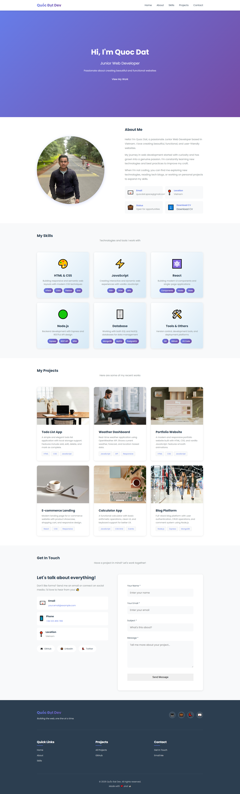

### Session 1 - Header Section
**📌 Học được:**
- `<!DOCTYPE html>`: Báo browser đây là HTML5
- `lang="vi"`: Giúp screen reader và SEO hiểu ngôn ngữ
- `charset="UTF-8"`: Hỗ trợ tiếng Việt, emoji, ký tự đặc biệt
- `viewport`: **BẮT BUỘC** cho responsive - báo browser scale đúng trên mobile

**📌 Tại sao semantic tags quan trọng?**
1. **SEO tốt hơn:** Google hiểu cấu trúc trang
2. **Accessibility:** Screen reader đọc được cho người khuyết tật
3. **Code dễ đọc:** Dev khác nhìn vào hiểu ngay
4. **Maintain dễ:** Không bị "div soup"

**📝 Các semantic tags cần nhớ:**
- `<header>`: Phần đầu trang hoặc section
- `<nav>`: Navigation menu
- `<main>`: Nội dung chính (chỉ 1 trên page)
- `<section>`: Nhóm nội dung có chủ đề
- `<article>`: Nội dung độc lập (blog post, product card)
- `<aside>`: Nội dung phụ (sidebar)
- `<footer>`: Phần cuối trang hoặc section

### 2.3. Container Pattern - QUAN TRỌNG!
**❌ SAI - Container bọc tất cả:**
**✅ ĐÚNG - Container TRONG từng section:**
**📌 Tại sao?**
1. **Background full width:** Section có thể có background gradient/image full màn hình
2. **Content giới hạn width:** Dễ đọc, không bị text chạy dài quá
3. **Flexibility:** Mỗi section tự do style background

### 3.2. CSS Variables (Custom Properties)

```css
:root {
    --primary-color: #667eea;
    --spacing-md: 2rem;
    --header-height: 70px;
}

/* Sử dụng */
.header {
    height: var(--header-height);
    background: var(--primary-color);
}
```

**📌 Ưu điểm:**
- Thay đổi 1 chỗ → apply toàn site
- Dễ maintain
- Dễ tạo dark mode sau này
- Tên biến dễ hiểu hơn `#667eea`

### 3.3. Units - px vs rem vs em
| Unit | Định nghĩa | Khi nào dùng |
|------|-----------|--------------|
| `px` | Pixel tuyệt đối | Border, shadow, không responsive |
| `rem` | Relative to root font-size (16px) | Font size, spacing - **RECOMMENDED** |
| `em` | Relative to parent font-size | Ít dùng, dễ bị lồng nhau phức tạp |
| `%` | Phần trăm của parent | Width, height |
| `vh/vw` | Viewport height/width | Full screen sections |
**📌 Ví dụ:**
```css
/* 1rem = 16px (default) */
font-size: 2rem;      /* = 32px */
margin: 1.5rem;       /* = 24px */
padding: 0.5rem;      /* = 8px */
/* Responsive tốt vì scale theo font-size */
```

### 3.4. Flexbox - Căn chỉnh elements
```css
.container {
    display: flex;
    justify-content: space-between;  /* Main axis (ngang) */
    align-items: center;             /* Cross axis (dọc) */
    gap: 1rem;                       /* Khoảng cách giữa items */
}
```

### 3.6. Pseudo-elements (::before, ::after)
```css
.nav-link::after {
    content: '';
    position: absolute;
    bottom: 0;
    left: 0;
    width: 0;
    height: 2px;
    background: var(--primary-color);
    transition: width 0.3s ease;
}

.nav-link:hover::after {
    width: 100%;
}
```

**📌 Học được:**
- Thêm element "ảo" KHÔNG CẦN HTML
- `content: ''` bắt buộc phải có
- Use case: Underline animation, icons, decorative elements
- `::before` (trước content) vs `::after` (sau content)

### 3.7. Transitions & Animations
**Transition - Smooth change:**
```css
.button {
    background: blue;
    transition: background 0.3s ease;
}
.button:hover {
    background: red;
    /* Chuyển từ blue → red trong 0.3s */
}
```

### Session 2 - Hero Section 
**Animation - Complex keyframes:**
```css
@keyframes fadeInUp {
    from {
        opacity: 0;
        transform: translateY(30px);
    }
    to {
        opacity: 1;
        transform: translateY(0);
    }
}
.hero-title {
    animation: fadeInUp 1s ease;
}
```
**📌 Timing functions:**
- `linear`: Đều đều
- `ease`: Chậm → nhanh → chậm (default, tốt nhất)
- `ease-in`: Chậm → nhanh
- `ease-out`: Nhanh → chậm
- `ease-in-out`: Chậm → nhanh → chậm (mượt hơn ease)
---

- `min-height: 100vh` → chiếm full màn hình
- `100vh` = 100% viewport height (màn hình cao bao nhiêu thì hero cao bấy nhiêu)
- `display: flex` + `align-items: center` → Content center theo chiều dọc

**Học được:**
- `linear-gradient(angle, color1, color2)`
- `135deg`: Góc chéo từ trái trên → phải dưới
- `0%` → `100%`: Color transition từ primary → secondary

**Gradient angles:**
```
0deg = ↑ (bottom to top)
90deg = → (left to right)
135deg = ↗ (diagonal)
180deg = ↓ (top to bottom)

- Cùng animation `fadeInUp` nhưng delay khác nhau
- `0s → 0.2s → 0.4s → 0.6s`: Tạo hiệu ứng "cascade"
- `backwards`: Giữ style của frame `from` trước khi animation chạy
```

### Session 3 - About Section 
**Học được:**
- `display: grid` → Layout 2D (rows + columns)
- `1fr 1fr` → 2 columns bằng nhau (50% - 50%)
- transform: scale(1.05) -> Phóng to 105% (5% lớn hơn)

- `grid-template-columns: repeat(auto-fit, minmax(200px, 1fr))`
- `repeat(auto-fit, ...)` → Tự động wrap khi không đủ space
- `minmax(200px, 1fr)` → Min width 200px, max fill available space
- **MAGIC:** Không cần media query, tự responsive!

- Sử dụng function IIFE để ngăn chặn người dùng tải xuống hình ảnh
- Mục đích: 
    * Chạy script ngay khi trình duyệt parse đến
    * Không tạo biến / hàm trong global scope
    * Tránh xung đột với script khác
    * Giúp code gọn gàng, an toàn và dễ maintain.

### Session 4 - Skils Section
*** Học được ***
 Grid Pattern:
- 6 cards sẽ tự động arrange thành grid
- Desktop: 3 columns
- Tablet: 2 columns
- Mobile: 1 column
- Auto-responsive Grid: `repeat(auto-fit, minmax(300px, 1fr))`
Grid tự động responsive không cần media query

### Session 5 - Skills Section
**Học được:**
- Card = flex column → Stack dọc
- `flex-grow: 1` → Tự động fill space
- `margin-top: auto` → Push tags xuống dưới cùng
- **Kết quả:** Tất cả cards cùng height, tags luôn ở bottom

### Session 6 - Contact Section
**Học được:**
- 1fr 1.2fr → Info nhỏ hơn, Form lớn hơn
- Form cần nhiều space hơn cho inputs


# 🌐 Landing Page Portfolio
Personal portfolio website showcasing web development skills and projects.
## 🚀 Live Demo
**[View Live Site →](https://datnguyen-ai.github.io/landing-page-portfolio/)**
## 📸 Preview


## 🛠️ Built With

- HTML5
- CSS3 (Flexbox, Grid, Animations)
- Vanilla JavaScript
- GitHub Pages

## ✨ Features

- ✅ Fixed responsive navigation
- ✅ Full-screen hero section with animations
- ✅ About section with profile
- ✅ Skills showcase with cards
- ✅ Projects portfolio with hover effects
- ✅ Contact form with validation
- ✅ Smooth scrolling & back-to-top button
- ✅ Fully responsive design

## 📂 Project Structure
```
landing-page-portfolio/
├── index.html
├── css/
│   └── style.css
├── js/
│   └── main.js
├── images/
└── README.md
```

## 🚀 Local Development
```bash
# Clone repository
git clone https://github.com/datnguyen-ai/landing-page-portfolio.git

# Navigate to project
cd landing-page-portfolio

# Open in browser
open index.html
```

## 📧 Contact

- **Email:** quocdat.space@gmail.com
- **GitHub:** [@datnguyen-ai](https://github.com/datnguyen-ai)

---

⭐ **Star this repo if you like it!**
Made with ❤️ and ☕